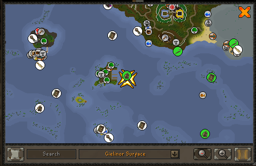

# Charting World Map

The Charting World Map plugin displays all charting locations on the world map with data and icons pulled from the wiki. Icons automatically update to show completion status when you chart a location.

## Settings

### Hide completed

Hide completed charting locations on the world map

### Hide generic markers

Hide generic charting locations on the world map

### Hide spyglass markers

Hide spyglass charting locations on the world map

### Hide drink crate markers

Hide drink crate charting locations on the world map

### Hide duck markers

Hide duck charting locations on the world map

### Hide diving markers

Hide diving charting locations on the world map

### Hide weather markers

Hide weather charting locations on the world map
